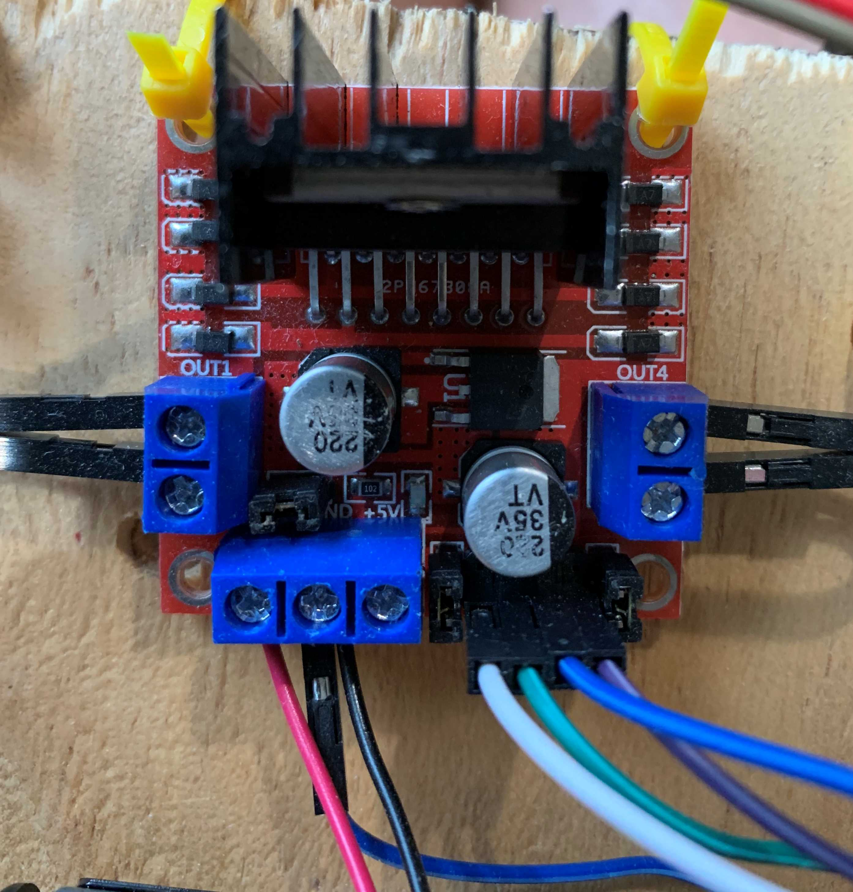

# Drive System Wiring

**Module Goal**: wiring the robots drive system to the Raspberry Pi.

Before doing the full assembly, you'll need to make sure your wheels work. This module will show you how to test it all -- using the Pi.

## Drive Wheel Assembly Steps

* On the L298N Motor Controller board, identify the wire ports labeled:
  * **OUT1**, **OUT2**, **OUT3**, & **OUT4**
  * **NOTE**: Make sure at least two teammates can find them.
* Using a screwdriver, loosen the screws in the terminal blocks labeled **OUT1**, **OUT2**, **OUT3**, and **OUT4**.
* With one wheel motor, insert the ends of the two wires into **OUT1** & **OUT2**
  * Do this again with the other motor and **OUT3** & **OUT4**
* Connect the wires from the battery holder to the L298N Motor Controller board.
  * **Black** wire to **GND**
  * **Red** wire to **12V**
* Tighten all screws _gently_ so that the wires stay in-place.

## Battery Assembly

The Raspberry Pi computer can only provide so much electrical energy to other things connected to it. In the case of the L298N motor controller and the wheels, they need more electricity than the Pi can give. :( 

No worries! You'll fix this problem by also connecting 4 AA batteries to the L298N and use _those_ to power the wheels.

* On the L298N Motor Controller board, identify the wire ports labeled:
  * **12V** & **GND**
  * **NOTE**: Make sure at least two teammates can find them.
* Grab the AA battery case and connect the wires from it to the L298N:
  * the **Red** wire on the AA battery case to **12V**
  * the **Black** wire on the AA battery case to **GND**
* Tighten all screws _gently_ so that the wires stay in-place.

## Connect the Raspberry Pi to your Components

Time to get your components connected to the robot brain -- the Raspberry Pi!

**NOTE**: Always keep your Pi turned **OFF** when connecting wires!

Get 5 female-to-female wires. If that are connected together along their length, gently pull them apart.

* On your L298N Motor Controller board, identify **IN1**, **IN2**, **IN3**, **IN4**.
* Connect the 4 wires to each of the **IN**s.

As a team, get your Raspberry Pi and observe the following picture. Make sure it makes sense when you look at the Pi. Talk through the ports labeled **GPIO** and **Ground**.

Now, make the following connections.

| L298N Connection Pin | Raspberry Pi Connection Pin |
| --- | ---- |
| **IN1** | GPIO 7|
| **IN2** | GPIO 8|
| **IN3** | GPIO 9|
| **IN4** | GPIO 10|
| **GND** | Ground (there are several; chose any you like) |

Now your Raspberry Pi and your L298N Motor Controller board are connected!

---

The L298N Motor Controller Board should be looking like this:

If you're not sure, ask Mr. Bowman for a double-check!

---

Connect the 4 AA batteries so that the L298N Motor Controller board has electrical power. It should have a bright red light if you've got the batteries connected correctly.

* Not working? Double-check your wire connections from above.

---

~Module Complete~
