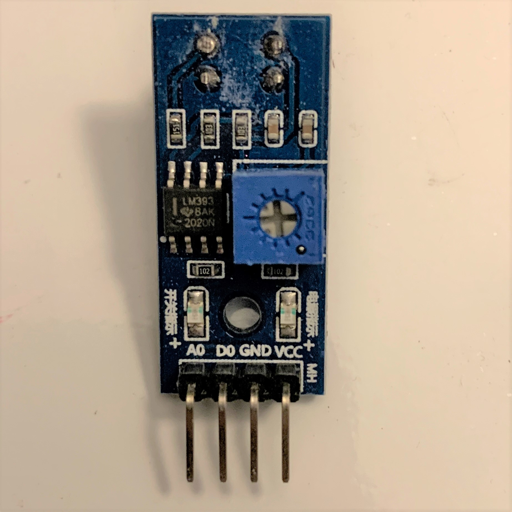
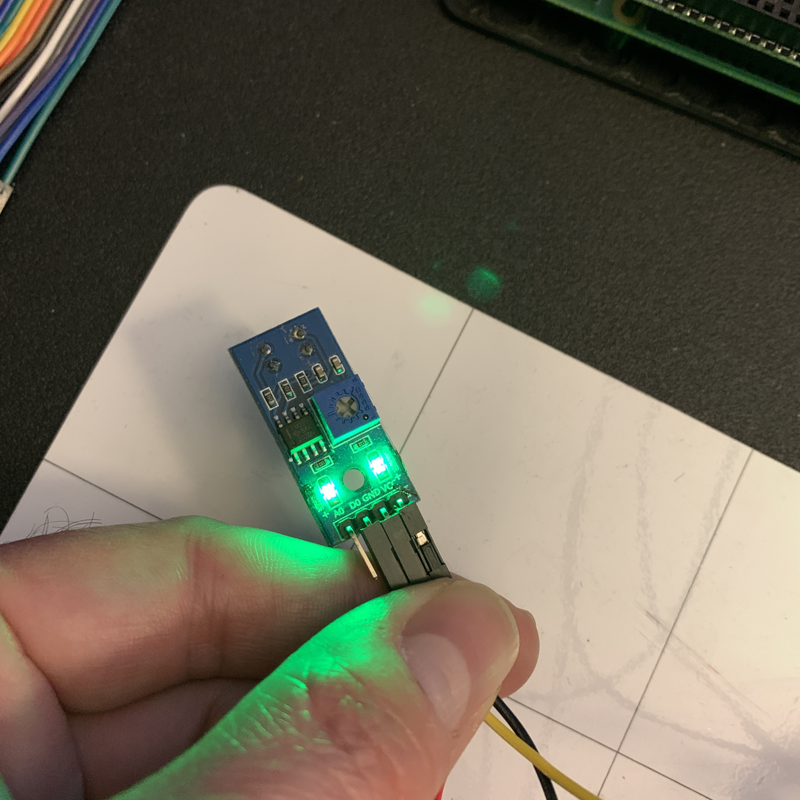
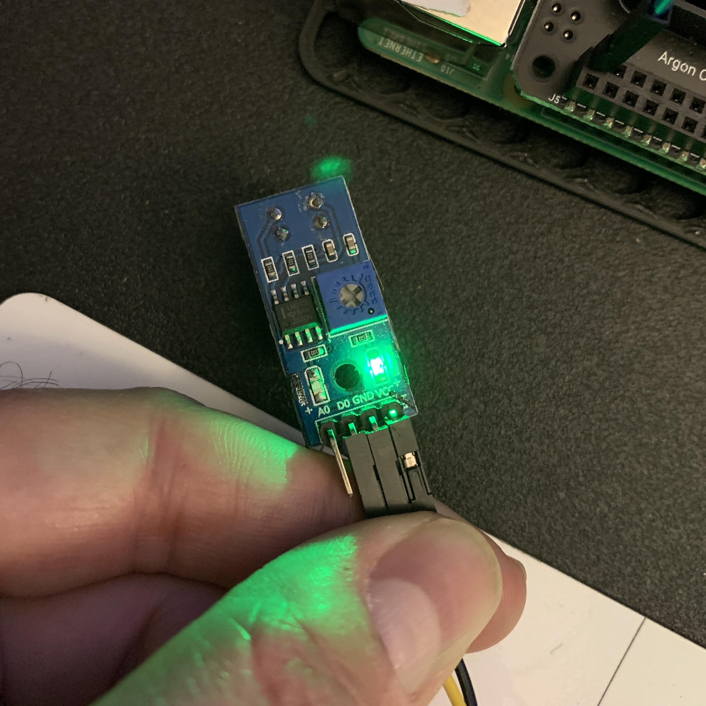

# Adding the Line Sensors

**Module Goal**: connect the line sensors to your Pi and tune each to recognize a black line on a white background.

*Acknowledgement*: significant portions of this module are copied directly from the [official Raspberry Pi tutorial](https://projects.raspberrypi.org/en/projects/rpi-python-line-following). But we skip the pesky soldering step :joy:

## What You Need

* 6 female-male wires (select two colors, if possible)
* Both line sensors

## Prepare the Connectors

> Turn the Raspberry Pi off.

1. Ask Mr. Bowman to strip some wires for you.

2. Lay the wires on your project mat in the shape of a **'Y'** with the wire ends at the junction.

3. Twist the wires together to connect the **'Y'**. Add electrical tape to secure them together.

Like this:


Do this again with three more wires. You should have 2 **'Y'** configurations now of two different colors.

## Connect the Line Sensors

1. Examine a line sensor and identify **VCC** (voltage), **GND** (ground), **DO** (digital out)



<br>
<br>
<br>
<br>

2. Take one of your three-wire **'Y'** jumper leads, and connect two of its ends to the **VCC** pin on each of the two sensors.


<br>
<br>
<br>
<br>

3. Do it again with other **'Y'**. Take the second of your **'Y'** jumper leads and connect two ends to the **GND** pin on each line sensor.


4. Take two more male-male wires and connect each one to the **DO** pin on each line sensors.


5. Now connect the wires to the Raspberry Pi:

* the **VCC** wire of both line sensors to a 5V pin on your Raspberry Pi;
* the **GND** wire of the sensors to a GND pin on your Raspberry Pi;
* the **LEFT** line sensor's **DO** pins must be connected to pin GPIO 17;
* the **RIGHT** line sensor's **DO** must be connected to GPIO 27.


## Tune the Line Sensors

> Turn your Raspberry Pi on.

The sensors have blue-green lights that turns on when the Raspberry Pi is powering them. The lights also tell you what the sensor is sensing. The lights should be bright when over a white area. And they should be off when over a dark area. 

If needed, use the small potentiometer on the board to tune your sensors, so that the LEDs turn off when over a dark spot and light up bright when over white space.

### Line Sensor Over White




### Line Sensor Over Black



## Line Sensing in Python Code

```python
'''
Working with line sensors
'''
from gpiozero import LineSensor
from time import sleep

def left_sensor_detected_white():
    print("left sensor on white...")
    return

def right_sensor_detected_white():
    print("right sensor on white...")
    return

def left_sensor_detected_black():
    print("left sensor on black...")
    return

def right_sensor_detected_black():
    print("right sensor on black...")
    return

if __name__ == "__main__":
    '''
    Code starts here
    '''

    # Setup the line sensors
    left_sensor = LineSensor(17)
    right_sensor = LineSensor(27)

    # left sensor functions
    left_sensor.when_no_line = left_sensor_detected_black
    left_sensor.when_line = left_sensor_detected_white

    # right sensor functions
    right_sensor.when_no_line = right_sensor_detected_black
    right_sensor.when_line = right_sensor_detected_white

    sleep(20)

    print("all done")
```

Once both line sensors and code work correctly, show Mr. Bowman!

---

**Module Complete**