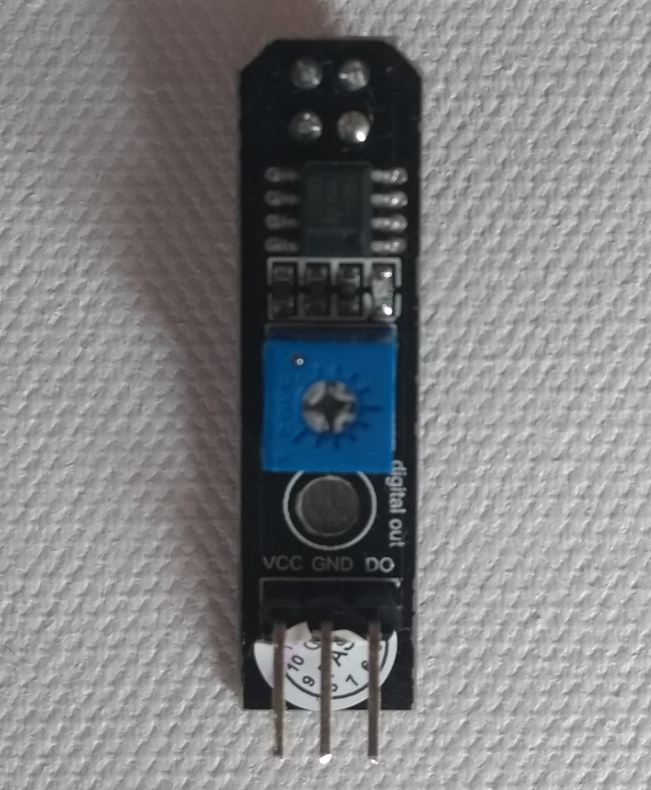
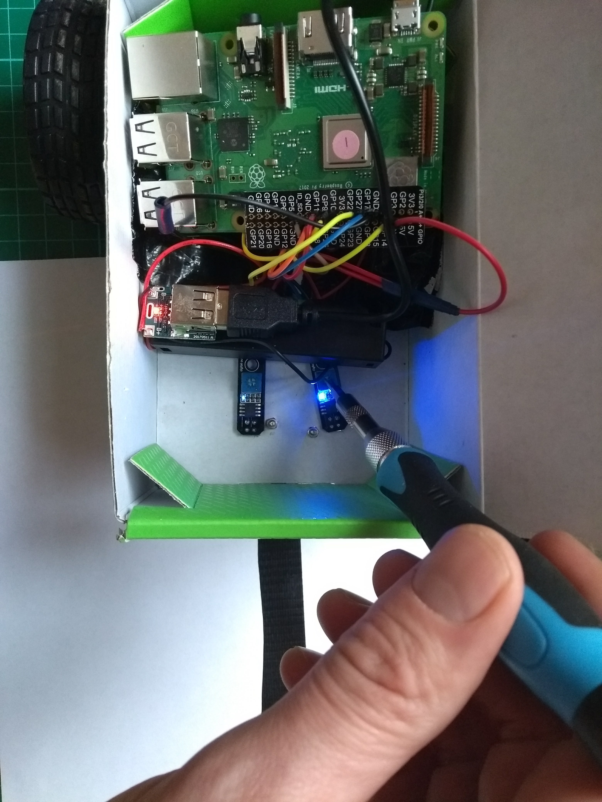

# Adding the Line Sensors

**Module Goal**: connect the line sensors to your Pi and tune each to recognize a black line on a white background.

*Acknowledgement*: significant portions of this module are copied directly from the [official Raspberry Pi tutorial](https://projects.raspberrypi.org/en/projects/rpi-python-line-following). But we skip the pesky soldering step :joy:

## What You Need

* 6 female-male wires (select two colors, if possible)
* Both line sensors

## Prepare the Connectors

> Turn the Raspberry Pi off.

1. Ask Mr. Bowman to strip some wires for you.

2. Lay the wires on your project mat in the shape of a **'Y'** with the wire ends at the junction.

3. Twist the wires together to connect the **'Y'**. Add electrical tape to secure them together.

Like this:

Do this again with three more wires. You should have 2 **'Y'** configurations now of two different colors.

## Connect the Line Sensors

1. Examine a line sensor and identify **VCC** (voltage), **GND** (ground), **DO** (digital out)

 
 
 
 

2. Take one of your three-wire **'Y'** jumper leads, and connect two of its ends to the **VCC** pin on each of the two sensors.

 
 
 
 

3. Do it again with other **'Y'**. Take the second of your **'Y'** jumper leads and connect two ends to the **GND** pin on each line sensor.

4. Take two more male-male wires and connect each one to the **DO** pin on each line sensors.

5. Now connect the wires to the Raspberry Pi:

* the **VCC** wire of both line sensors to a 5V pin on your Raspberry Pi;
* the **GND** wire of the sensors to a GND pin on your Raspberry Pi;
* the **LEFT** line sensor's **DO** pins must be connected to pin GPIO 17;
* the **RIGHT** line sensor's **DO** must be connected to GPIO 27.

6. Attach the line sensors to your chassis. Remember, zip-ties are your friend!!

    * Take a look at Mr. Bowman's robot if you need some hints or ideas.

## Tune the Line Sensors

> Turn your Raspberry Pi on.

The sensors have a blue light that turns on and off. It should be on when over a white area on the floor. It should be off when over a dark area. But, you have to make sure this works correct. 

1. Use the small potentiometer on the board to tune your sensors, so that the LEDs turn off when over a dark line, and lights up blue when over white space.

Once both line sensors work correctly, show Mr. Bowman!

## Line Sensing in Python Code

---

**Module Complete**