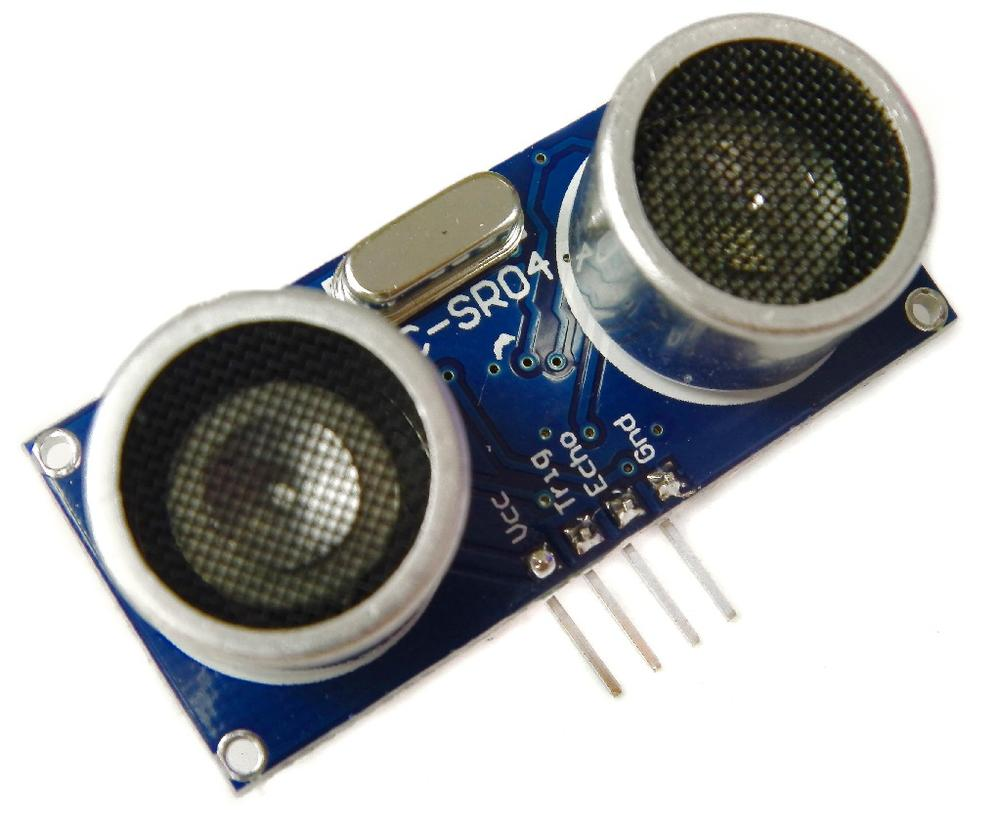
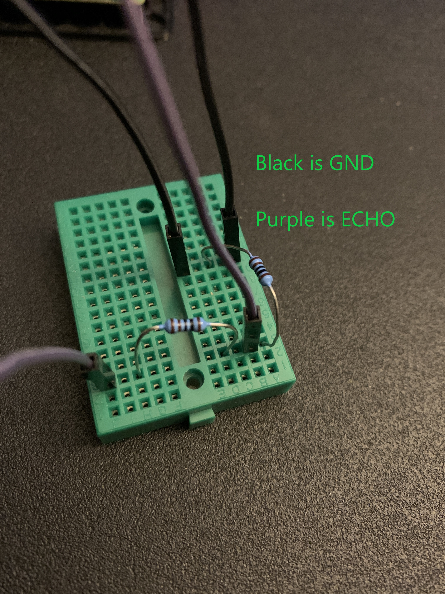

# Sense an Obstacle

**Module Goal**: connect your obstacle sensor and write Python code to use it!

*Acknowledgement*: images and python code snippets in this module are copied directly from the [this excellent PiHut tutorial](https://thepihut.com/blogs/raspberry-pi-tutorials/hc-sr04-ultrasonic-range-sensor-on-the-raspberry-pi).

## What You Need

* 8 wires (select four unique colors, if possible)
* the obstacle sensor
* two resistors (ask Mr. Bowman)
* the breadboard 

## Assembly

Examine the obstacle sensor's four connections. It looks like this:



Connect these wires:

* Connect the **VCC** wire to pin 2 on the Raspberry Pi
* Connect the **TRIG** wire to pin 23 on the Raspberry Pi

Now for the breadboard connections. First, add your resistors like this:



Next:

* Connect the **GND** wire to any GND on the Raspberry Pi
  * connect the other end to the breadboared like in the picture 
* Connect the **ECHO** wire to pin 24 on the Raspberry Pi
  * connect the other end to the breadboard like in the picture

This sensor can only work with some code to interpret the signals.

## Python Code

```python
import RPi.GPIO as GPIO
import time
 
#GPIO Mode (BOARD / BCM)
GPIO.setmode(GPIO.BCM)
 
#set GPIO Pins
GPIO_TRIGGER = 23
GPIO_ECHO = 24
 
#set GPIO direction (IN / OUT)
GPIO.setup(GPIO_TRIGGER, GPIO.OUT)
GPIO.setup(GPIO_ECHO, GPIO.IN)
 
def distance():
    # set Trigger to LOW, then HIGH
    GPIO.output(GPIO_TRIGGER, False)
    time.sleep(1)
    GPIO.output(GPIO_TRIGGER, True)
 
    # set Trigger after 0.01ms to LOW
    time.sleep(0.00001)
    GPIO.output(GPIO_TRIGGER, False)
 
    StartTime = time.time()
    print(f'StartTime:{StartTime}')
    StopTime = time.time()
    print(f'StopTime:{StopTime}')
 
    # save StartTime
    while GPIO.input(GPIO_ECHO) == 0:
        pass
    StartTime = time.time()
 
    # save time of arrival
    print('looking for low while high')
    while GPIO.input(GPIO_ECHO) == 1:
        pass
    StopTime = time.time()
    print('echo went low and exited')
 
    # time difference between start and arrival
    TimeElapsed = StopTime - StartTime
    # multiply with the sonic speed (34300 cm/s)
    # and divide by 2, because there and back
    distance = (TimeElapsed * 34300) / 2
 
    return distance
 
if __name__ == '__main__':
    try:
        while True:
            dist = distance()
            print ("Measured Distance = %.1f cm" % dist)
            time.sleep(1)
 
        # Reset by pressing CTRL + C
    except KeyboardInterrupt:
        print("Measurement stopped by User")
        GPIO.cleanup()
```

## Try It Out

Place your sensor directly in front of a solid object that is close-by (1 foot away). Run the script and observe the output.

Hopefully, you've got sensor readings telling you how far away (approximately) the object is.

---

**Module Complete**