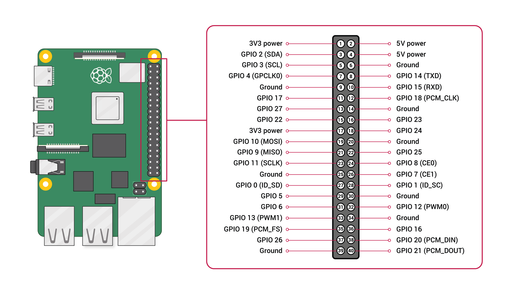

# Basic Sensor Circuits

## Light Emitting Diode (LED)

_Reference_: https://projects.raspberrypi.org/en/projects/rpi-connect-led

You'll need:

* an LED;
* a 220 Ohm resistor;
* two male-male wires;
* a breadboard.

First, examine the LED. Find the positive wire by carefully reviewing the picture below.


Now, organize your wiring such that the positive side of the LED connects to the **RED** wire. And add the resistor. Like below:


Then find a GND output from the Raspberry Pi and connect a wire from that to the same row as the resistor.



One you complete the wiring connections, you should have a brightly lit LED!


### LED with a Switch

Quick Modification. The above circuit doesn't use the switch at all. What can you do to make the switch control the on-off behavior of the LED?


### Control the LED with Python

Remove the red switch and let's control the LED using python software. Make sure the LED is on again, like above.

On the Raspberry Pi, open Code and start a new file (`led_control.py` or something like that).

Use some python code like this:

```python
import RPi.GPIO as GPIO
import time

GPIO.setmode(GPIO.BCM)

print("LED will turn off...")
GPIO.setup(2, GPIO.OUT)
GPIO.output(2, GPIO.LOW)

time.sleep(5)

print("LED will turn on...")
GPIO.output(2, GPIO.HIGH)

time.sleep(5)

GPIO.cleanup()
```

## Obstacle Detection


## Line Detection


## Color Sensing

---

**Module Complete**
