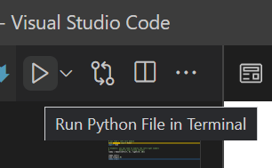

# Vehicle Control

**Module Goal**: learn to make Robby go forward & backward, left & right.

## Forward & Stop

Make `Robby` go forward for twenty seconds and then stop. Enter this code into `vscode`:

```python
#!/bin/python3

from gpiozero import Robot
import time

robby = Robot(left=(7, 8), right=(9, 10))

robby.forward()
time.sleep(20)
robby.stop()
```

Save the file as: `go_forward.py`. Then run it. You can use the arrow to run it: 



`Robby` should drive forward for 20 seconds or so. Look over the code and discuss. What are these lines of code doing?

## Backwards too!

Make `Robby` go forward and backward like this:

```python
#!/bin/python3

from gpiozero import Robot
import time

robby = Robot(left=(7, 8), right=(9, 10))

robby.forward()
time.sleep(20)
robby.stop()
robby.backward()
time.sleep(20)
robby.stop()
```

Does the tank stop where it started? 

## Stop & Turn

When you have a tank drive system like `Robby`, the tracks provide both the drive motion of the vehicle and also the steering control. How does steering work? Because it can make the two tracks turn opposite directions from each other. 

In the python language we're using, we have some commands that will help us do this:
* `stop()` will make the wheels stop spinning;
* `sleep()` will make the current motion continue for some amount of time;
* `left()` will make `Robby` turn left;
* `right()` will make `Robby` turn right.

Time to try it out. In `vscode`, create a new file and add this:

```python
#!/bin/python3

# our team's left turn module
from gpiozero import Robot
import time

robby = Robot(left=(7, 8), right=(9, 10))

robby.left()
time.sleep(1.0)
robby.stop()
```

Make sure you save it: `turn_left.py`. Then run it. You can use the arrow to run it: 


`Robby` should turn left by some amount. Maybe not much, maybe a lot. Discuss what happened.

**Challenge**: what can you do to make `Robby` turns a precise 90-degrees? Make it happen!

## Turn Right

To turn right, just change one line of code. I bet you can guess which one :grin:

Change `robby.left()` to `robby.right()`!

## Turning While Going Forward

Now, the code you've written so far makes `Robby` stop before turning. But, that's not super practical. Let's make `Robby` turn while driving forward.

Modify the code above to this:

```python
robby.forward(curve_right=1)
```

Or, you can use `curve_left`. But, you can't use them both at the same time :grin:

**Challenge**: what can you do to make `Robby` turns in a circle (left or right)? Make it happen!

---

**Module Complete**
